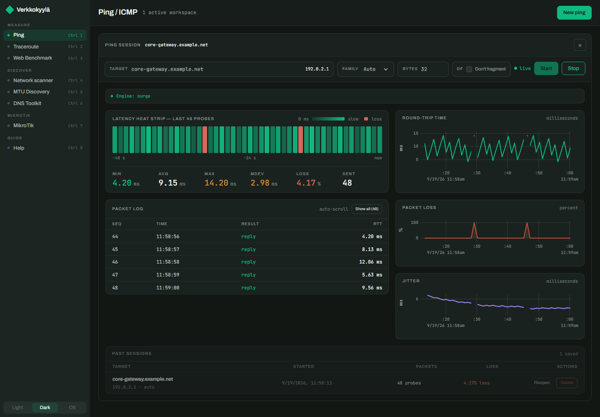
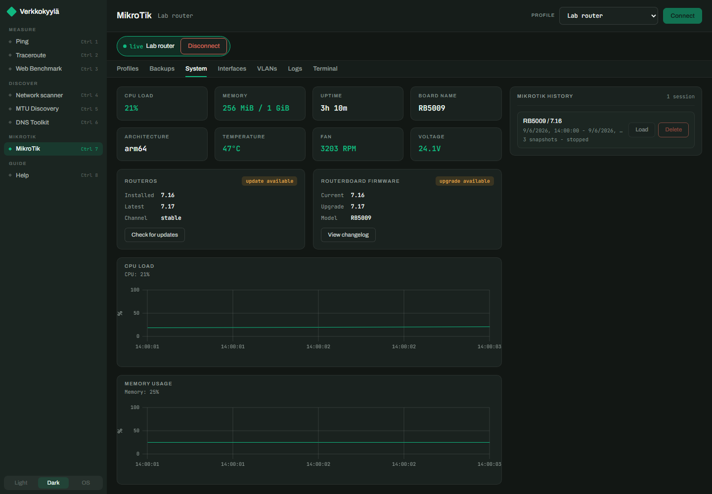
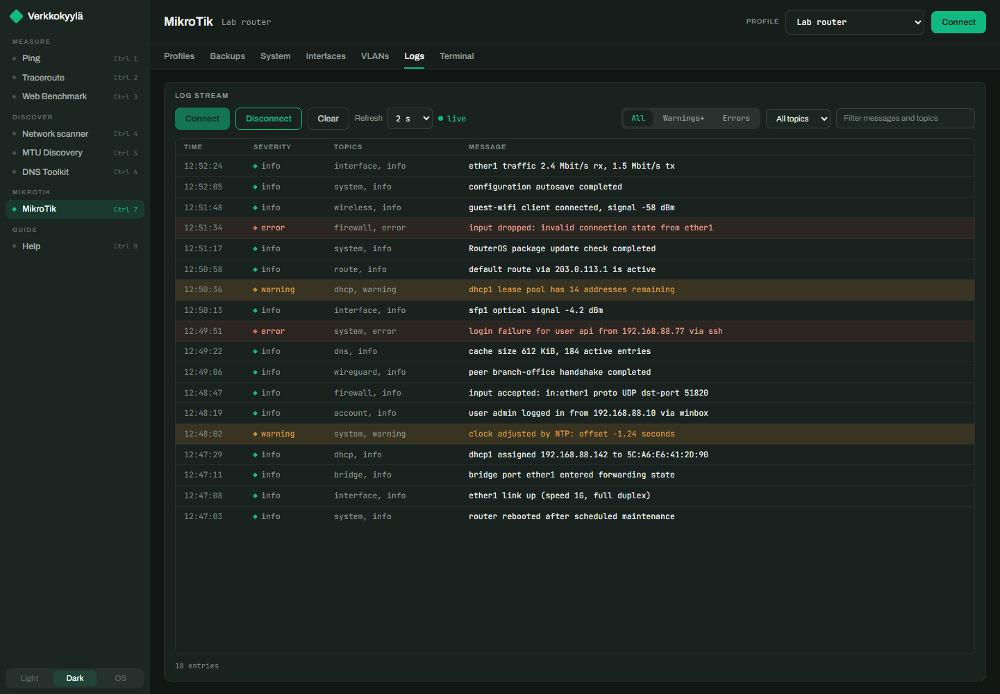
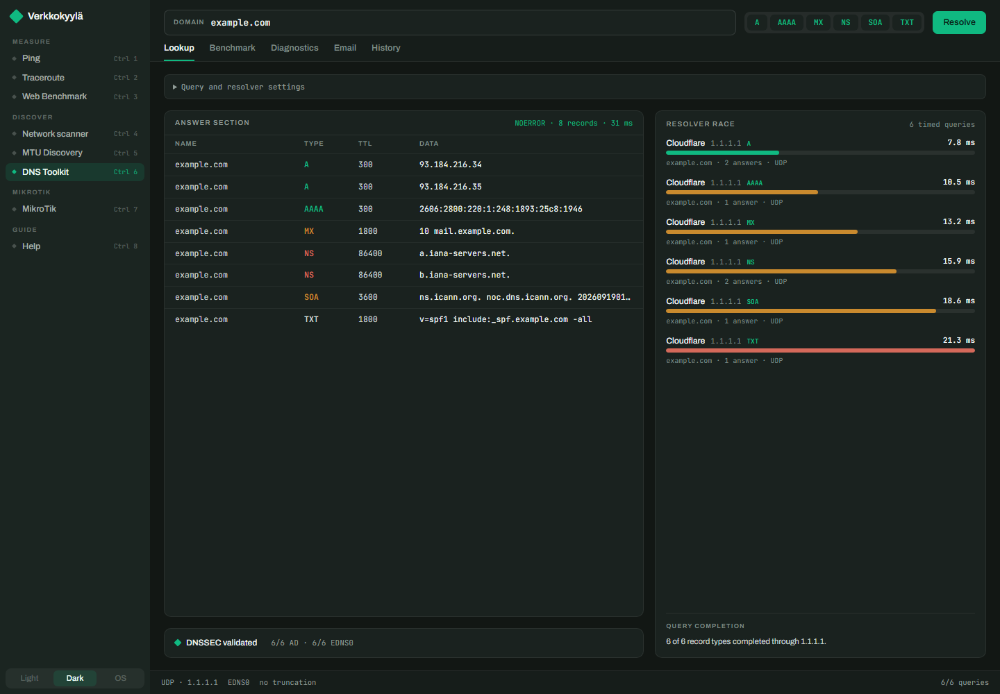
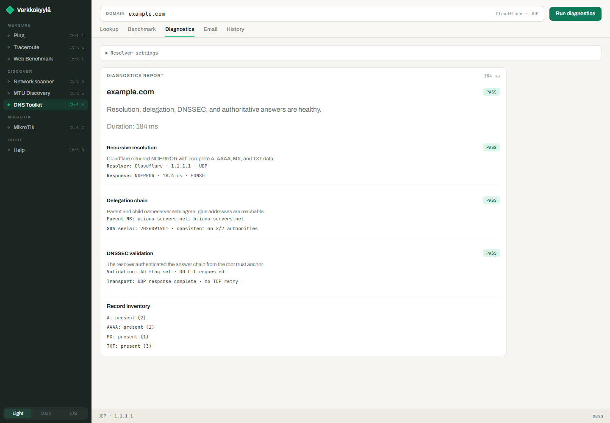

# Verkkokyylä

[](https://github.com/tero-k/verkkokyyla/actions/workflows/ci.yml)
[](https://github.com/tero-k/verkkokyyla/releases)
[](LICENSE)

A desktop network toolbox for Windows, macOS, and Linux (Tauri 2). It bundles
the everyday network tools (ping, traceroute, a web download benchmark, a LAN
scanner, MTU discovery, and DNS diagnostics) with MikroTik router management:
multi-device live monitoring, log streaming, interactive SSH terminals, and
backup downloads.

Everything a tool measures is kept in a local SQLite history you can reopen
later. MikroTik passwords live in the operating system keyring, never in the
database. An in-app **Help** view (sidebar or `Ctrl 8`) explains each tool.

> The name is Finnish: *verkko* (network) + *kyylä* (a ferret; someone who
> snoops around). A network ferret.



## Download

Grab the latest installer from
[GitHub Releases](https://github.com/tero-k/verkkokyyla/releases): Windows
(NSIS/MSI installer, or the standalone exe zip — it needs the WebView2
runtime, preinstalled on up-to-date Windows 10/11), macOS (dmg, or the raw
`.app` tarball — signed and notarized), and Linux (deb/rpm, or the portable
AppImage). Or build from source — see [Development](#development).

## Screenshots

| | |
|---|---|
|  |  |
|  |  |

## Tools

- **Ping / ICMP**: live latency table and graph with reopenable session
  history. The engine is chosen automatically per platform.
- **Traceroute**: the OS-native traceroute with hops streaming in live, kept
  in history like ping sessions.
- **Web Benchmark**: download-speed test against a URL with live progress and
  final stats.
- **Network scanner**: discovers hosts on the local network.
- **MTU Discovery**: finds the path MTU with Don't-Fragment ICMP probes
  (bracketing steps, then binary search) and falls back to TCP PLPMTUD probing
  on Linux when ICMP is filtered.
- **DNS Toolkit**: resolver diagnostics with an evidence chain for pinning
  down where resolution breaks.
- **MikroTik**: see below.

Navigation: sidebar groups (Measure / Discover / MikroTik / Guide) with
`Ctrl 1`–`Ctrl 8` shortcuts; Light/Dark/OS theme switcher at the bottom.

## MikroTik

- **Profiles & credentials**: one profile per router (host, REST port,
  username). The password is stored in the OS keyring; the app database keeps
  only connection metadata. On Linux the keyring needs a running DBus Secret
  Service (for example gnome-keyring or KWallet); without one, credential
  storage is unavailable.
- **Monitoring**: connect a profile for live resources, interface rates,
  VLANs, and version/firmware status. Devices run independently: one session
  per device, up to eight concurrent. Monitoring keeps collecting while you
  use other tools, and stopped sessions are saved to history.
- **Logs**: per-device live log stream with severity highlighting and text
  filtering; streams also keep running in the background.
- **Terminal**: interactive SSH shell, one per device. Shells survive device
  and tool switching with scrollback intact. A colored identity tag on each
  terminal (mirrored by a `term` pill on the device chip) shows which
  router the shell drives, and switching between open terminals raises a
  warning that names the connection (silenceable for the session).
- **Backups**: the app asks RouterOS to create a backup file, downloads it
  over SFTP, and removes the temporary file. The last-used destination folder
  is remembered across restarts. Backups with the `.rsc` export can be
  compared in the library: select two to see a line-by-line config diff.

**Requirements:** RouterOS v7.1 or newer with the `www-ssl` service enabled
for HTTPS REST API access; plain HTTP is supported on v7.9+ with `www`. The
router's SSH service must be enabled for terminals and backups.

**Accepted risk:** for typical LAN-managed routers, the app accepts unknown
SSH host keys on first connection instead of requiring a pre-seeded
known-hosts entry.

## Development

Requires [Rust](https://rustup.rs/) and [Node.js](https://nodejs.org/).

```bash
npm install
```

## Tests

```bash
# Rust unit + integration tests
cargo test --manifest-path src-tauri/Cargo.toml

# Rust E2E tests that hit real network adapters (requires admin/root on Windows)
cargo test --manifest-path src-tauri/Cargo.toml -- --ignored e2e

# Frontend unit tests
npx vitest run

# UI E2E tests with Playwright (uses a Tauri mock)
npx playwright test
```

## Running

```bash
# Vite dev server + Tauri in dev mode
npm run tauri -- dev

# Production build (standalone exe + NSIS/MSI installers)
npm run tauri -- build
```

## Project layout

- `src-tauri/src/`: Rust backend with session managers, ping engines, MikroTik
  monitoring/logs/terminal/backup managers, stats, SQLite persistence.
- `src/`: React + TypeScript frontend with views per tool, live graphs, session
  history, in-app Help.
- `e2e/`: Playwright E2E tests with an in-browser Tauri mock.
- `src-tauri/tests/`: Rust integration tests against the real backend.

## Notes

- On Windows the app tries the `surge-ping` engine first and falls back to
  `winicmp`; on POSIX it tries `surge-ping` first and falls back to `osping`.
- The live ping table caps visible rows at 500; the graph can show the full
  session.

## Contributing

Contributions are welcome — see [CONTRIBUTING.md](CONTRIBUTING.md) for the dev
setup, test commands, and commit conventions. Please report security issues
privately per [SECURITY.md](SECURITY.md). Notable changes are tracked in
[CHANGELOG.md](CHANGELOG.md).

## License

[MIT](LICENSE) © tero-k
